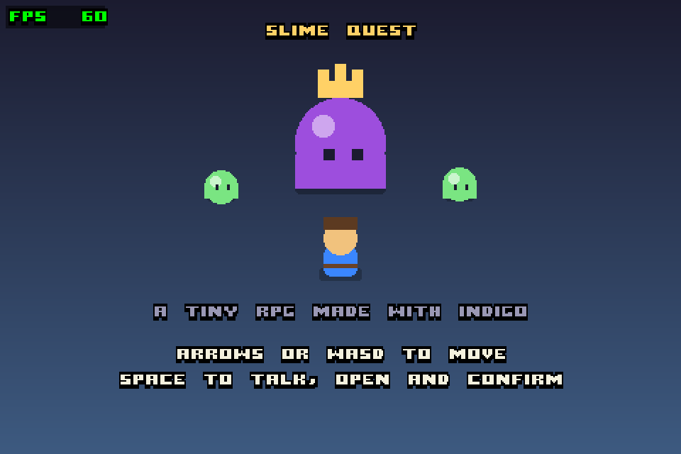
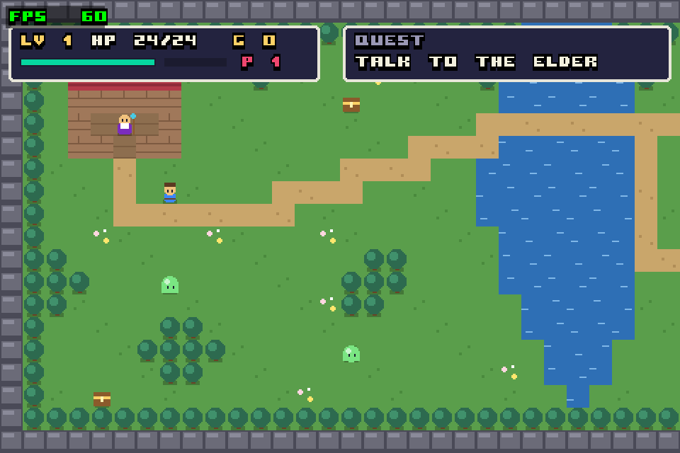
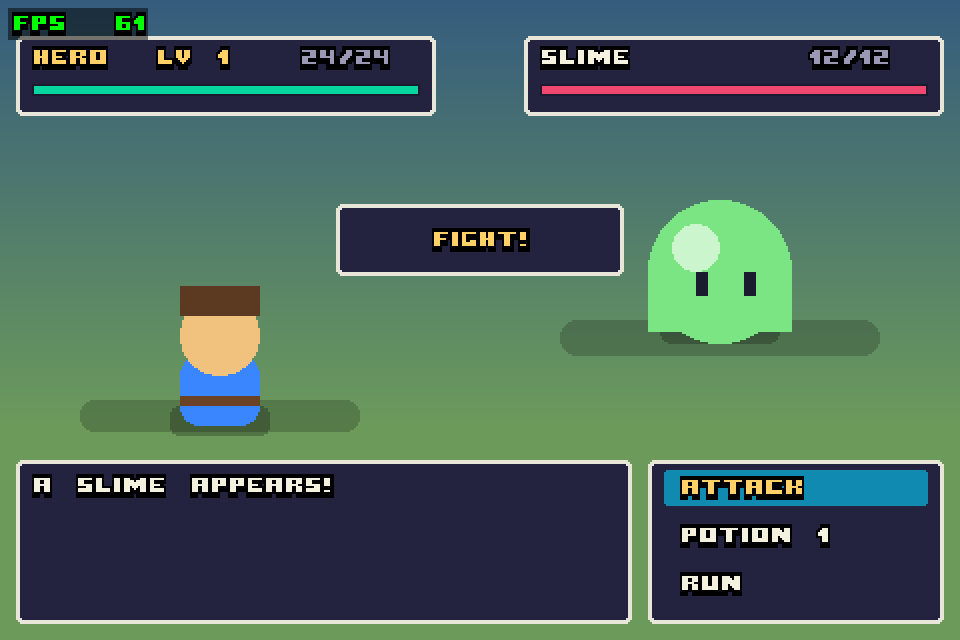

# indigo-game-starter-template

A starter template for browser games built with [Indigo](https://indigoengine.io) `0.30.0-M6`, a
purely functional game engine for Scala 3 / Scala.js, structured the way
[The Elm Architecture](https://guide.elm-lang.org/architecture/) (TEA) web apps are: every scene
is a `Model` / `Msg` / `update` / `ui` / `subscriptions` module, and the root routes between them.

It comes with a small but complete example game to build on, **Slime Quest**: a top-down RPG
where you talk to the village elder, fight slimes in turn-based battles, loot chests, level up,
and defeat the Slime King in the ruins east of the river. Each scene fades in and plays a short
sound on entry.

To start your own game, clone the repository, keep the generic `game` module and package (or
rename them), and replace the scenes in `game/src/game/scene/`, keeping the structure described
below.

## Screenshots

| Title | World | Battle |
| --- | --- | --- |
|  |  |  |

## Controls (Slime Quest)

| Key                  | Action                                  |
| -------------------- | --------------------------------------- |
| Arrows / WASD        | Move (tap for one tile, hold to walk)   |
| Space / Enter / Z    | Talk, open chests, confirm battle menu  |
| Up / Down (battle)   | Choose Attack / Potion / Run            |

## Requirements

- A JDK (tested with OpenJDK 21), for Mill and the Scala compiler.
- Node.js (tested with 24), which runs the Scala.js unit tests.
- Python 3, only to serve the build locally and to regenerate assets (`game/tools/`).

Mill itself needs no install: the bundled `./mill` launcher downloads the pinned version.

## Commands

This is a Mill 1.x build (the version is pinned in `.mill-version`, use the bundled `./mill` launcher).
The game is the `game` module: sources in `game/src/game/` (the `game` package), tests in
`game/test/src/game/`, assets in `game/assets/`.

```bash
./mill game.test          # run the unit tests (pure game logic)
./mill game.indigoBuild   # build a static site into out/game/indigoBuild.dest
./mill game.indigoRun     # run in Electron
./mill __.reformat        # scalafmt
./mill clean game         # see below
```

If the compiler reports an *old* signature for something re-exported by a barrel (`WorldScene.init`
still taking the old parameters, say), the incremental build has kept a stale barrel: run
`./mill clean game` and build again.

To play in a browser, serve the build output:

```bash
python3 -m http.server 8421 --directory out/game/indigoBuild.dest
```

## Coming from Scala / Indigo? What's unusual here

This template is written to read like a TEA web app, for developers coming from Elm, Haskell or
TypeScript TEA libraries such as react-tea-cup. Several choices differ from typical Scala or
Indigo code, on purpose:

| You might expect | Here | Why |
| --- | --- | --- |
| Indigo `Scene`s, a `SceneManager`, `SceneEvent.JumpTo` | **Not used.** The root routes: `Model.route: SceneRoute` picks the scene, and `Program.scenes` is just `NonEmptyBatch(Scene.empty)` | In Indigo's scene system the game-level update never calls a scene's update, so a parent can't delegate to or intercept its children. Indigo's own perf sandbox runs the same way. |
| Scenes emitting custom `GlobalEvent`s to talk to each other | **No messages from child to parent** (no `OutMsg`). The parent calls the child's `update`, then *intercepts* the child's `Msg` in a `flatMap` and reads the child's updated model (`world.encounter`, `Quest.Complete`) | TEA child msg interception, as in TEA web apps. `GlobalEvent`s are only effects: engine ones (`PlaySound`), or a scene's own events (`BattleEvent`). |
| Scene state created up front | Each scene's `init(shared, ...): Outcome[Model]` runs when the root navigates there, with entry effects (fade-in, sound; the battle also emits its own `BattleEvent.FightStarted`, which comes back as `Msg.FightStarted`) | A TEA page's `init(shared, route): [Model, Cmd]`. |
| `updateModel` pattern-matching raw `GlobalEvent`s | `subscriptions` first turns engine events (`FrameTick`, keys) into the module's own `Msg`; `update` only ever sees `Msg` | Same split as Elm's `subscriptions` / `update`. |
| `context` passed around | `Shared(now, dice, viewport)`, built once per frame | The only per-frame inputs `update` / `ui` need; keeps them pure and testable (`Dice.loaded(n)`). |
| Top-level `def`s spread over a package | **One file, one module**: every `X.scala` is `object X` (or a type `X` with its companion), even `Update.scala`; siblings imported explicitly | Mirrors Haskell's `module A.B.X` per file. |
| `package.scala` / package objects as barrels | Haskell-style barrels **next to** the folder: `scene/WorldScene.scala` re-exports `scene/worldscene/`, used as `import game.scene.WorldScene` → `WorldScene.update` | Like `WorldScene.hs` next to `WorldScene/`, or an `index.ts`. |
| Extension methods (`model.enemyAt(pt)`) | **Plain curried functions, data last**: `enemyAt(pt)(model)`, `damage(amount)(stats)`; chains use the stdlib's `pipe`: `model.copy(...).pipe(withToast(msg, now))` | Reads like Elm / Haskell (`enemyAt pt model`, `\|>`). |
| `view` / `render` / `draw` names | `ui`; every function returning a drawing type ends in `UI` (`hudUI`, `boxUI`) | Tells you at a glance what draws. |
| `Model`, `Logic`, `View` files | `Type` / `Update` / `Subscription` / `UI` per module | The file names of a TEA web app's modules (`type.ts`, `update.ts`, ...). |

The full rules are in **[doc/code-convention.md](doc/code-convention.md)**. Everything builds with
`-Werror`, so unused imports fail the build.

## Coming from Elm / Haskell? Read it like this

| Scala here | Elm / Haskell |
| --- | --- |
| `X.scala` containing `object X` | a module file, `module Game.Scene.WorldScene.Update` |
| `import game.scene.worldscene.Type.*` | `import Game.Scene.WorldScene.Type` (unqualified) |
| `import game.scene.WorldScene`, then `WorldScene.update(...)` | `import qualified Game.Scene.WorldScene as WorldScene` |
| `enum Msg: case Walk(direction: Direction)` | `type Msg = Walk Direction \| ...` |
| `final case class Model(...)` | a record type alias / data record |
| `model.copy(player = p)` | `{ model \| player = p }` |
| `derives CanEqual` | `deriving Eq` |
| `Option`, `Batch`, `x match { case ... }` | `Maybe`, `List`, `case x of` |
| `Outcome[Model]` | `( Model, Cmd Msg )` |
| `Outcome(model).addGlobalEvents(e)` | `( model, cmd )` |
| `init(shared, ...): Outcome[Model]` | `init : Flags -> ( Model, Cmd Msg )` |
| `enum BattleEvent extends GlobalEvent`, emitted in an `Outcome` and turned into a `Msg` by `subscriptions` | a `Cmd` whose result comes back as a `Msg` (`Task.perform`) |
| `outcome.flatMap(m => ...)` | chaining updates (the `updateAndCmd` helper common in tea-cup codebases): runs the next step, keeps both steps' effects |
| `subscriptions(model, keyboard): GlobalEvent => Option[Msg]` | `subscriptions : Model -> Sub Msg` |
| `Msg.ActionMenuMsg(subMsg)` | `ActionMenuMsg ActionMenu.Msg` with `Cmd.map` / `Html.map` |
| `ui(shared, model): SceneUpdateFragment` | `view : Model -> Html msg` (but it never emits messages; input comes through `subscriptions`) |
| `shared.dice`, `shared.now` | a seeded `Random.Seed` and `Time.Posix` handed in, never `IO` |
| `enemyAt(pt)(model)` | `enemyAt pt model` (curried, data last) |
| `x.pipe(f).pipe(g)` (`scala.util.chaining`) | `x \|> f \|> g` |

Nothing in this codebase uses mutable state, `var`, type classes (`given`) or implicit conversions.

**Where to start:** `game/src/game/Main.scala` (the program), then the root `Type.scala` /
`Update.scala`, then one scene: `scene/WorldScene.scala` and the files in `scene/worldscene/`.

## Architecture

The code is organised like a TEA web app, with game terms: a root program that routes between **scenes** (a TEA *page*), each scene with
`Type` / `Update` / `Subscription` / `UI` (TEA's *view*). Parents use TEA child msg interception;
there are no messages from child to parent.
**[doc/tea-isomorphism.md](doc/tea-isomorphism.md)** explains the mapping in detail, and
**[doc/code-convention.md](doc/code-convention.md)** lists the naming rules (e.g. functions that
return drawing types end in `UI`).

```
game/src/game/
  Main.scala           entry point, the Indigo Game, mainUI           ~ root.tsx + program.tsx + app.tsx
  Type.scala           root Model (route + scene models), Msg         ~ type.ts
  Update.scala         root init, update: delegate, intercept, route  ~ update.ts
  Subscription.scala   the showing scene's subscriptions, wrapped     ~ subscription.ts
  common/
    Types.scala        barrel: re-exports types/ (import game.common.Types.*)
    types/             Character, Entity, Direction, Ending, Level, Placement, SceneRoute, Shared,
                       Tile, TileMap
    util/              pure helpers: Character, TileMap, LevelParser, Dialogue, Input
    constant/          Layout, Layers, Maps (the ASCII overworld)
    asset/             GameAssets (font, asset list), Sfx (sound effects)
  ui/                  reusable UI: PanelUI, BarUI, LabelUI, ScreenUI, CharacterSpriteUI,
                       FadeInUI                                                   ~ component/
  theme/               Palette
  scene/                                                              ~ page/
    TitleScene.scala  WorldScene.scala  BattleScene.scala  EndScene.scala
                         barrels: each re-exports its folder          ~ page/<name>/index.ts
    titlescene/  worldscene/  battlescene/  endscene/
      Type.scala         Model, Msg
      Update.scala       init(shared, ...) and update(shared, msg, model), both Outcome[Model]
      Subscription.scala engine events (keys, FrameTick) -> Msg
      UI.scala           ui(shared, model): SceneUpdateFragment       ~ component.tsx
      subui/             scene-only UI: stateless XxxUI.scala (e.g. HudUI, TerrainUI) or
                         a stateful TEA module folder (e.g. battlescene/subui/actionmenu/)
      common/            scene-local helpers (world: queries, camera)
game/test/src/game/    mirrors the source tree
game/tools/
  gen_tileset.py       regenerates assets/tiles.png (pure Python, no dependencies)
  gen_sfx.py           regenerates the scene-entry sounds, assets/sfx_*.wav (same)
```

There is no mutable state: randomness and time arrive in `Shared` (the frame's deterministic
`Dice` and clock), and effects are `GlobalEvent`s returned inside `Outcome`, the game's
`[Model, Cmd]`. Navigation is plain state: the root model's `route`.

### Performance

Indigo's ordinary primitives top out at a few hundred per frame. The map is therefore drawn with
`CloneTiles` from a generated tileset: everything except water is one static, cached batch, and
water is a small animated batch. Characters, UI and text stay as ordinary primitives. Use the
FPS counter (top-left) to check changes; the game is capped at 60 FPS.

The layout follows the browser window: the camera and HUD use the real viewport, the map is
centred when the window is larger than it, and the title / battle / end screens are designed at
480x320 game pixels and centred.

### Editing the map

`Maps.overworld` in `common/constant/Maps.scala` is plain ASCII:

`.` grass, `,` flowers, `=` path, `_` floor, `~` water, `T` tree, `#` rock, `H` wall, `R` roof,
`@` player start, `E` elder, `s` slime, `K` Slime King, `c` chest.

`MapsTests` checks that the elder, the king and every chest are reachable from the start.

## Changelog and releases

See [CHANGELOG.md](CHANGELOG.md) for what changed in each version, and
[doc/release.md](doc/release.md) for how a release is made.

## License

[MIT](LICENSE)
